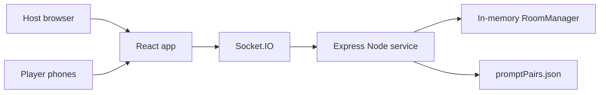

# Architecture

## Overview

Off Prompt is a single-service realtime web app.

## Client

The React app renders two experiences:

- host display at `/host/:roomCode`
- player controller at `/play/:roomCode`

The client stores temporary recovery tokens in `localStorage`. These tokens let a refreshed host or phone rejoin a room if the server still has it in memory.

## Server

The server owns all game authority:

- room creation and expiry
- player joins and duplicate-name checks
- host and player reconnects
- prompt validation, selection, and rendering
- Off-Prompt and Criminal assignment
- answer and vote validation
- scoring, elimination, and win conditions

The server emits separate state views:

- `host:state` contains public host display data.
- `player:state` contains one player's private prompt and player-specific actions.

## Prompt Privacy

Prompt pairs are loaded from `server/src/data/promptPairs.json`. The frontend never imports this file. During a round, the server renders a prompt pair and stores `promptByPlayerId`. Each player receives only that player's assigned prompt.

## Deployment Shape

Production uses:

1. `npm run build`
2. compiled client in `client/dist`
3. compiled server in `server/dist`
4. Express static serving from the Node service
5. Socket.IO on the same HTTP server and port

## Scaling Later

The current room manager is intentionally in-memory. Before running multiple server instances, add:

- Redis adapter for Socket.IO
- shared room state storage
- durable prompt/admin database
- observability and rate limiting
